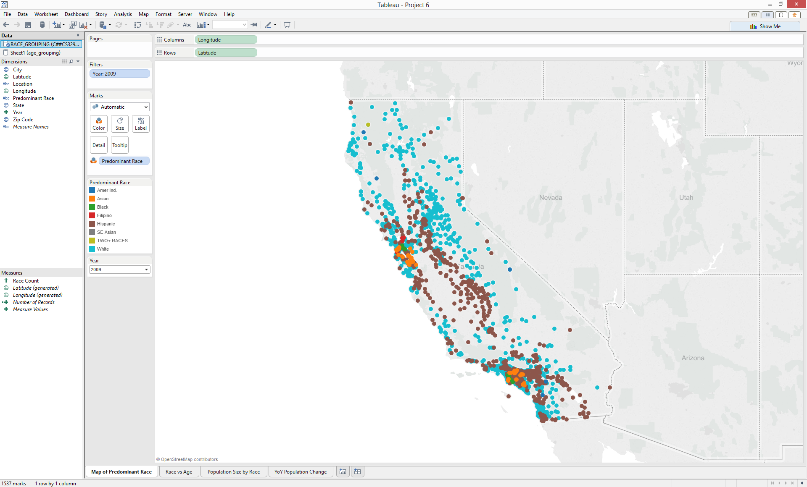
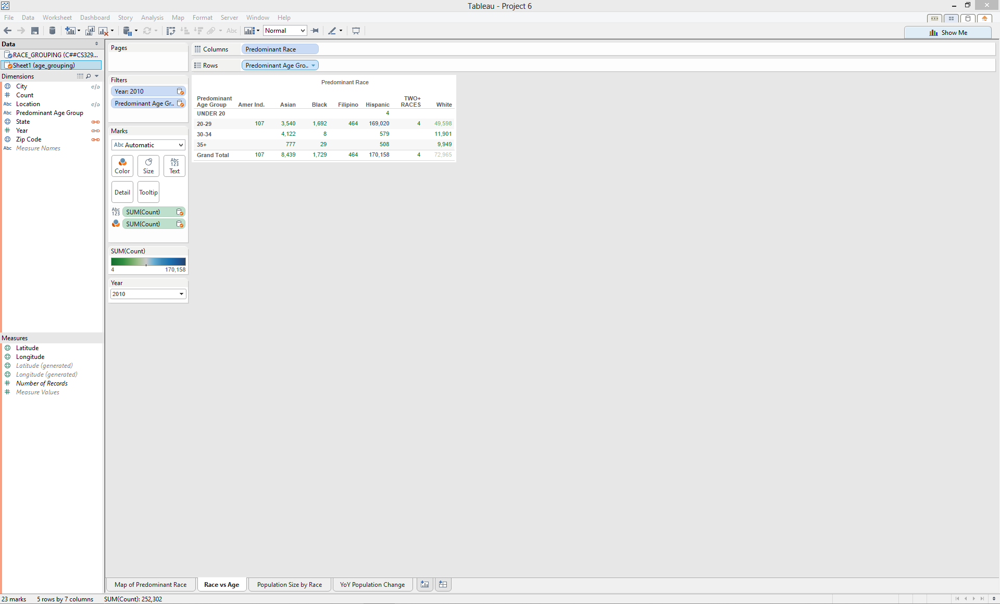
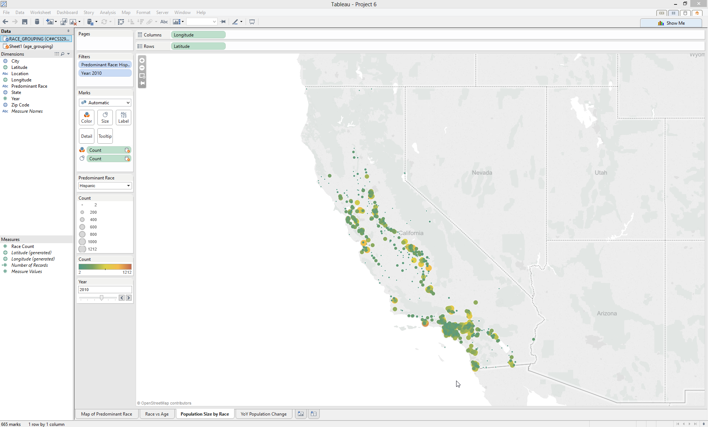
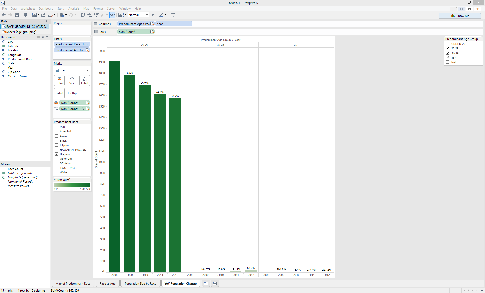

#Summary:
##### For this project, we analyzed California's birth trends. We took factors such as race, age, and locations to find possible relationships between births of babies to these factors.

##The first visualization we created in Tableau was a map of California that shows the predominant race in each zip code. This shows us which areas are predominantly occupied by which race.

#####To replicate this, we first connected to our raw data of race by zip code (race_grouping). We then connected to age_grouping in Oracle, which gives us the predominant race in each zip code, and total counts.

#####1.) We blended the data by linking year, state, and zip code.

#####2.) Then we put year in “Filters” so we can view how the race changes year over year. we had to change Year to “Discrete” so Tableau wouldn’t make it a range of values. we made the filter a Single Value (dropdown list) for ease of use. Then we clicked “Show quick filters” on the Year dropdown, and dragged the filter to the left side of the screen so it’s easy to see.

#####3.) Then we put latitude in rows and longitude in columns to visualize the map.

#####4.) To have a color diagram, we then dragged “Race” onto the Color block for Marks.

##The second visualization is a table of race vs. age. Each zip code was given a predominant race and a predominant age, and we can see how many mothers fall into each bucket. From this table we learn that a majority of births in California are white or hispanic. Hispanic mothers tend to be younger (age 20-29) and white mothers have births at more spread out times in their lives.

#####1.) To duplicate this table, we connected Age_grouping and Race_grouping, two tables that summarized each zip code by race and age.

#####2.) We blended the data by linking year, zip code, and state.

#####3.) we then dragged Predominant Age Group to rows and Predominant Race to columns.

#####4.) Then we put year in “Filters” so we can view how the race changes year over year. we had to change Year to “Discrete” so Tableau wouldn’t make it a range of values. we made the filter a Single Value (dropdown list) for ease of use. Then we clicked “Show quick filters” on the Year dropdown, and dragged the filter to the left side of the screen so it’s easy to see.

#####5.) Next, we dragged Count (from Age Grouping) to the Color box on Marks.

#####6.) we then clicked on the Color box, chose Edit colors, and changed the setting to “Blue Green diverging”. It didn’t look great, so we clicked “Advanced” in the Edit colors box, and set the “Center” to be 80,000 which tended more towards the median.

#####7.) Then under “Analysis” on the tool bar, we chose Totals > Show Column Grand Totals so we could see the total number of each zip code.

##The third visualization is another map, this time where one predominant race and one year is chosen. The map then depicts the population in each zip code by size and color. This helps us determine where people of each race live, and how many of them live there.

#####1.) To produce this, simply keep the same data blend as previously.

#####2.) Then we dragged Latitude to rows and Longitude to columns.

#####3.) Next, we dragged Count to the Size and Color boxes in Marks.

#####4.) we edited the Color theme to Temperature Diverging.

#####5.) we made Year and Predominant Race a filter, and selected “Show Quick Filter” in the dropdown so we could toggle between them.

#####6.) we made the filters “Single value (dropdown list)” to make it easier to user.

##The fourth visualization is the year over year change by race in predominantly Hispanic zip codes. We created this visualization to see how cities with major Hispanic population changes over time. We wanted to partition by age group (all mothers age 20+) to see how this changes.

#####1.) To replicate this, we kept the connection of race_grouping and age_grouping, linked by zip code, year, and state.

#####2.) We put Predominant Race in “Filters” so we can choose only “Hispanic”.
We then put Predominant Age in “Filters” so we can choose only 20-29, 30-34, and 35+. The other buckets had negligible populations so we omitted them.

#####3.) We then put “Predominant Age Group” (from age_grouping) and “Year” in columns, in that order.

#####4.) Finally, we put “SUM(Count)” as a continuous aggregate measure in the Label block for Marks. We also added it to Color in Marks. Additionally, we added it to Rows so we can make a bar graph.

###### NOTE: To calculate YOY change, we added a table calculation to SUM(Count) as a Label. This was done by selecting Quick Table Calculation > Percent Difference. We then went into Edit Table Calculations and made sure the Calculation Definitions were as follows:

######--Calculate the difference along: Pane (Across)
######--Display the value as a percent difference from: Previous

######This gave us the % YOY change in population by age group for all Hispanic zip codes. We learned that 20-29 year old mothers are having less babies over time and mothers 30 and older are having more.
